# 🎬 Netflix Clone | End-to-End DevSecOps CI/CD Project


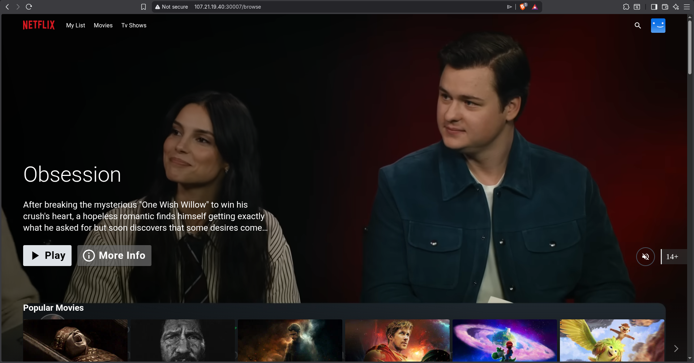

## 📌 Project Overview
This project demonstrates a **complete DevSecOps CI/CD pipeline** for deploying a Netflix clone application. The pipeline automates code checkout, static analysis, security scanning, Docker image building, and deployment to both Docker containers and a Kubernetes cluster. The entire infrastructure is monitored using **Prometheus** and visualized with **Grafana**.

## 🏗️ Architecture Diagram
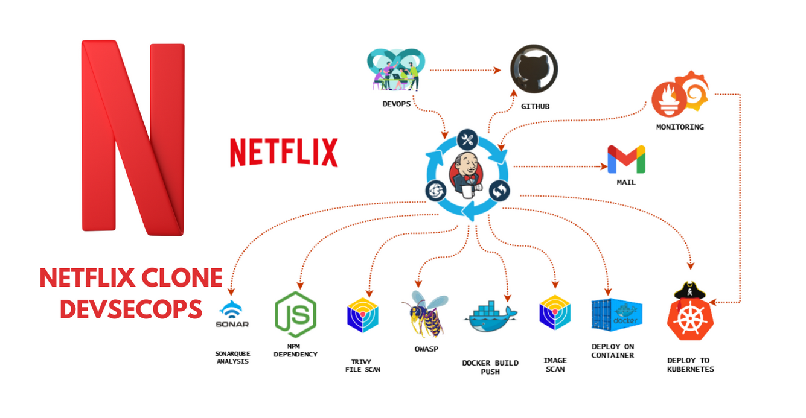

### 🎯 Key Objectives Achieved
- ✅ Build a fully automated CI/CD pipeline using **Jenkins** (Pipeline as Code)
- ✅ Containerize the application using a **multi-stage Dockerfile** (Node.js + Nginx)
- ✅ Perform **static code analysis** with **SonarQube** and enforce a **Quality Gate**
- ✅ Integrate **security scanning** using **Trivy** (Filesystem & Container Image)
- ✅ Deploy to **Docker container** and a production-like **Kubernetes cluster** (1 Master + 1 Worker)
- ✅ Monitor Jenkins, Kubernetes nodes, and application metrics using **Prometheus** and **Grafana**
- ✅ Implement **automated email notifications** with security scan reports

---

## 🛠️ Tech Stack

| Category | Tools |
|----------|-------|
| **CI/CD** | Jenkins (Declarative Pipeline) |
| **Containerization** | Docker (Multi-stage builds) |
| **Orchestration** | Kubernetes (Master + Worker Node) |
| **Code Quality** | SonarQube (Quality Gate) |
| **Security Scanning** | Trivy (Filesystem & Image) |
| **Monitoring** | Prometheus, Grafana, Node Exporter |
| **Cloud** | AWS EC2 (Ubuntu 26.04) |
| **Version Control** | GitHub (Jenkinsfile as code) |
| **Notification** | Email (with attachments) |

--- 

## 📂 Repository Structure
```text

devsecops-netflix-clone/
│
├── Jenkinsfile                                     
├── Dockerfile                                      
├── .dockerignore                                   
├── .gitignore                                      
├── .env.example                                    
│
├── Kubernetes/
│ ├── deployment.yml                                
│ └── service.yml                                   
│
├── src/                                            
├── public/                                         
├── package.json                                    
├── yarn.lock                                       
│
└── README.md                                       
```
---
## 🚀 CI/CD Pipeline Stages (Jenkins)
The pipeline is defined as code in the `Jenkinsfile`. Below is the breakdown of each stage:

| Stage | Tool | Description |
|-------|------|-------------|
| **Clean Workspace** | `cleanWs()` | Ensures fresh build environment |
| **Checkout from Git** | Git | Clones the latest code from GitHub |
| **SonarQube Analysis** | SonarScanner | Static code quality and security analysis |
| **Quality Gate** | SonarQube | Waits for quality gate result |
| **Install Dependencies** | `npm install` | Installs Node.js dependencies |
| **Trivy FS Scan** | Trivy | Scans filesystem for vulnerabilities |
| **Docker Build & Push** | Docker | Builds image and pushes to Docker Hub |
| **Trivy Image Scan** | Trivy | Scans the container image for vulnerabilities |
| **Deploy to Container** | Docker | Deploys to a test Docker container (port 80) |
| **Deploy to Kubernetes** | `kubectl` | Applies K8s manifests to the cluster |

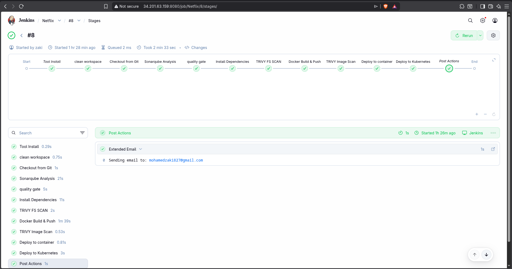

---
## ☸️ Kubernetes Cluster

The application is deployed on a **production-like Kubernetes cluster** with one master and one worker node.

### Cluster Nodes, Pods, SVC, Deployment, Endpoints

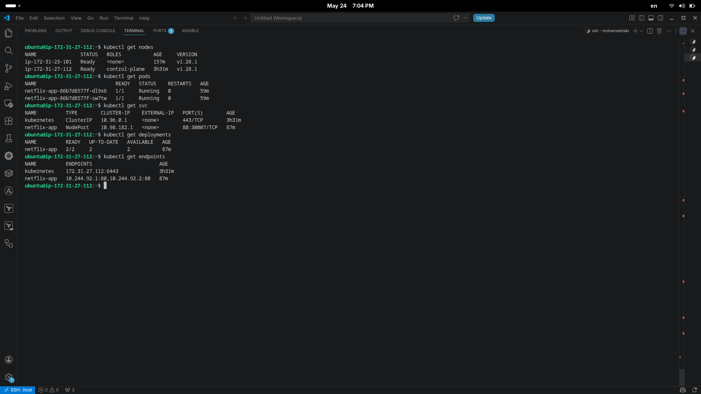

## 🎯 Application Demo
The Netflix clone is accessible via the Kubernetes NodePort service on port 30007.

#### Homepage
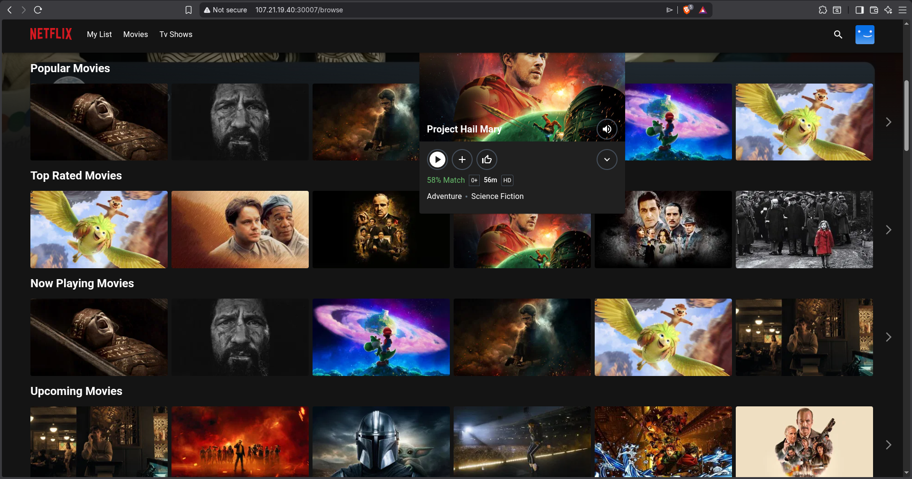

## 🔒 Security Scanning with Trivy
As part of the DevSecOps pipeline, Trivy scans both the filesystem and the final Docker image for vulnerabilities.

### 📊 Scan Results Summary

#### Container Image Scan
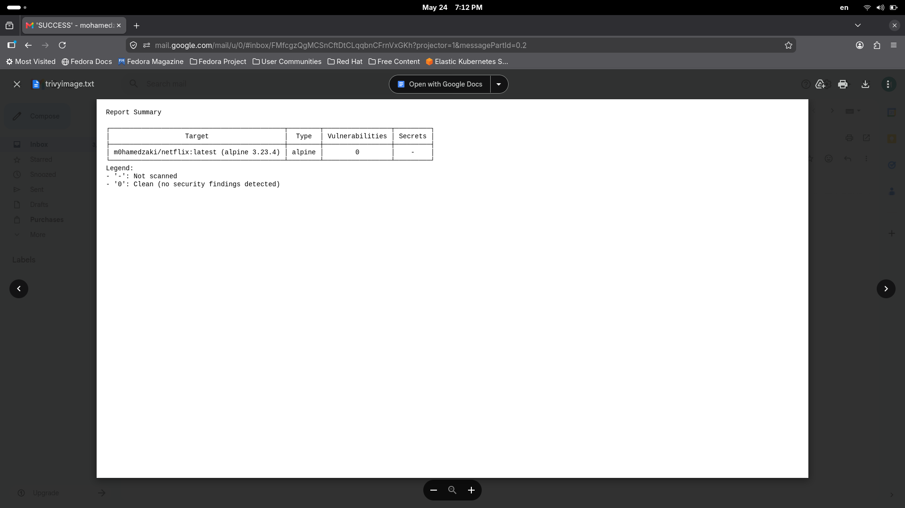

#### Filesystem Scan
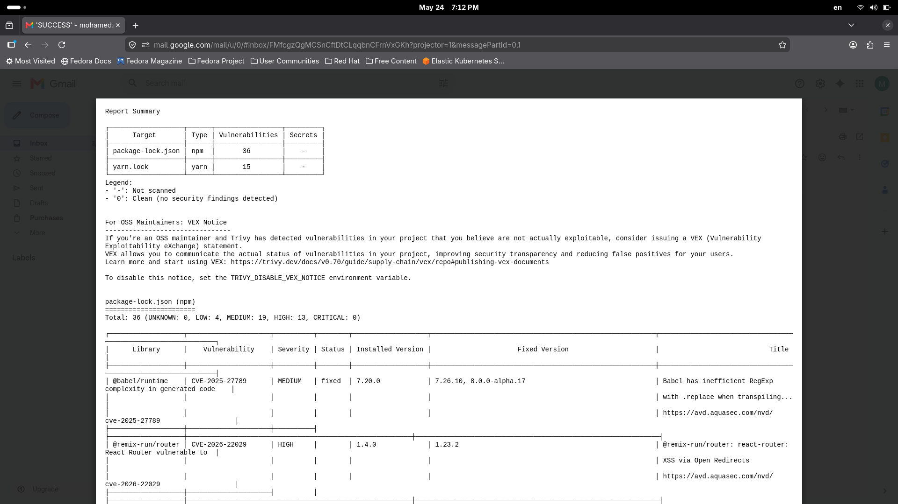


## 📧 Automated Email Notifications

After every pipeline execution, Jenkins sends an email with build status and attachment reports.

### Email Screenshot
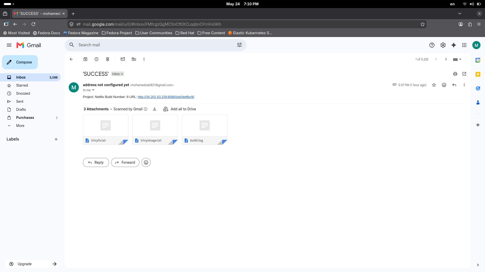

#### Attachments included:
- trivyfs.txt – Filesystem vulnerability report
- trivyimage.txt – Container image vulnerability report
- build.log – Full console output

## 📊 Monitoring Stack (Prometheus + Grafana)

### Prometheus Targets
All targets (Prometheus, Master Node, Worker Node, Jenkins) are healthy and scraping metrics.

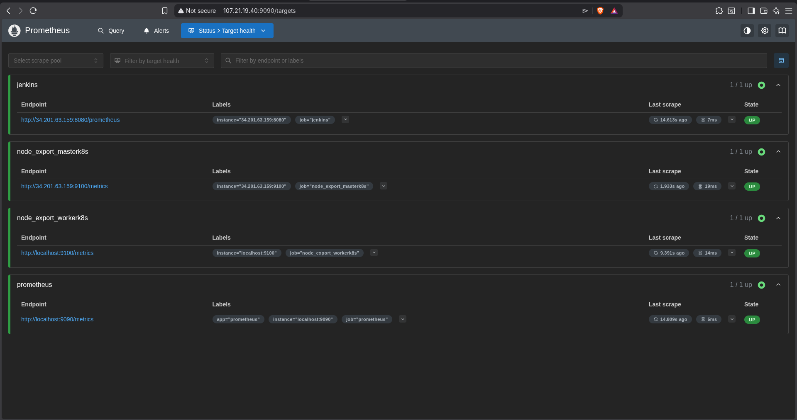

### Grafana Dashboards
Custom dashboards visualize:
- Jenkins build metrics
- Kubernetes node metrics (CPU, Memory, Disk)
- Node Exporter system metrics

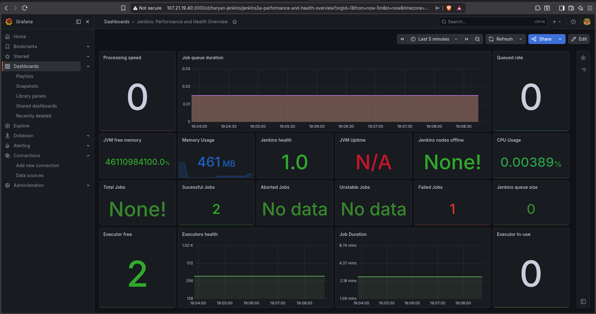
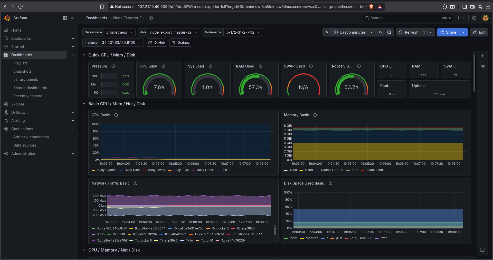
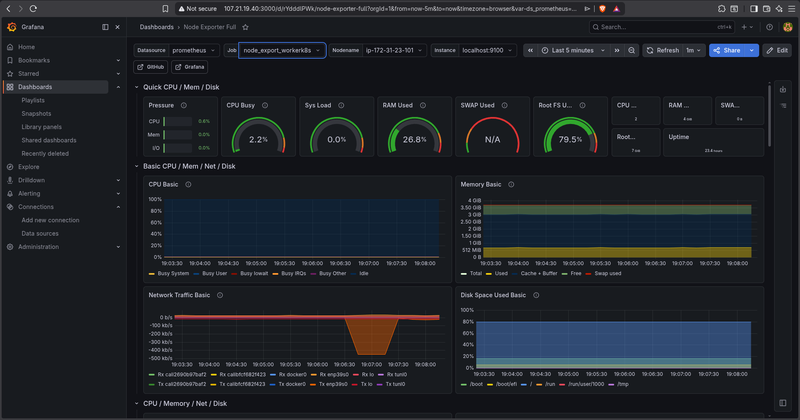

## 🐳 Docker Hub Repository
The Docker image is stored in Docker Hub with latest tag.
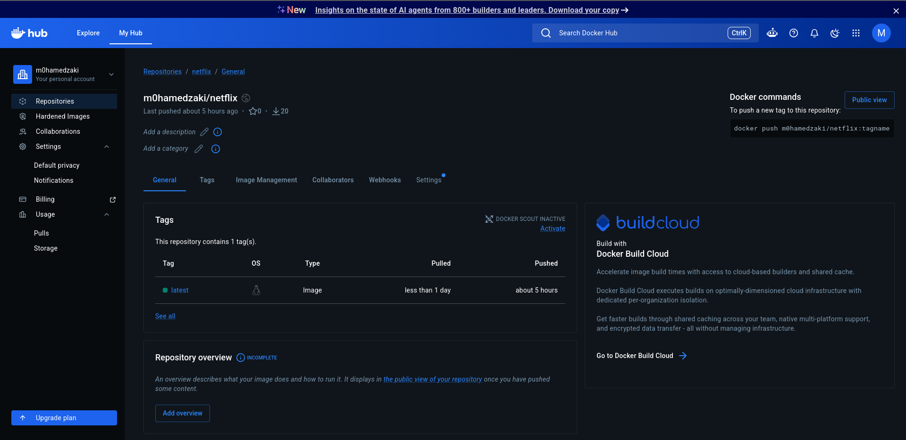


## 🧪 Quality Gate (SonarQube)

SonarQube performs static code analysis and enforces a quality gate before allowing the pipeline to proceed.

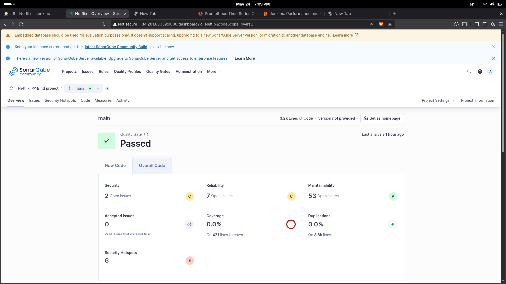

## 🚀 Project Setup & Deployment 

### Prerequisites
- Jenkins server with Docker, Trivy, kubectl, and Node.js 16+
- Kubernetes cluster (Kubeadm) (1 master + 1 worker)
- Docker Hub account
- TMDB API key
  
### Quick Start
1. **Clone the repository**
```bash
git clone https://github.com/Mohamedzaakii/devsecops-netflix-clone.git
cd devsecops-netflix-clone
```
---
2. **Configure Jenkins credentials**

| Credential ID | Type | Purpose |
|---------------|------|---------|
| `tmdb-api-key` | Secret text | TMDB API key for Docker build |
| `docker` | Username/Password | Docker Hub authentication |
| `Sonar-token` | Secret text | SonarQube API token |
| `k8s` | Kubeconfig file | Kubernetes cluster access |

---

3. **Run the pipeline**
- Create a new Pipeline job in Jenkins
- Point it to this repository's Jenkinsfile
- Click Build Now

The pipeline will automatically:
- ✅ Checkout code from GitHub
- ✅ Run SonarQube analysis with quality gate
- ✅ Scan for vulnerabilities with Trivy
- ✅ Build and push Docker image to Docker Hub
- ✅ Deploy to Kubernetes cluster


## 👨‍💻 Author

**Mohamed Zaki**
- GitHub: [@Mohamedzaakii](https://github.com/Mohamedzaakii)
- Email: [mohamedzaki827@gmail.com](mailto:mohamedzaki827@gmail.com)

## 🙏 Acknowledgements
- DevSecOps project inspiration from [MrCloudBook](https://mrcloudbook.com)
